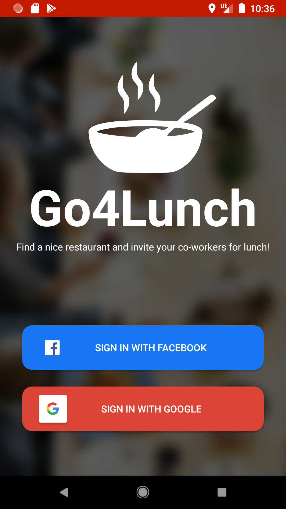
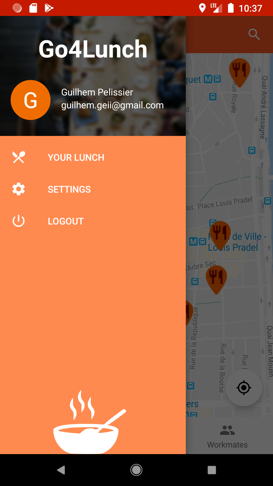
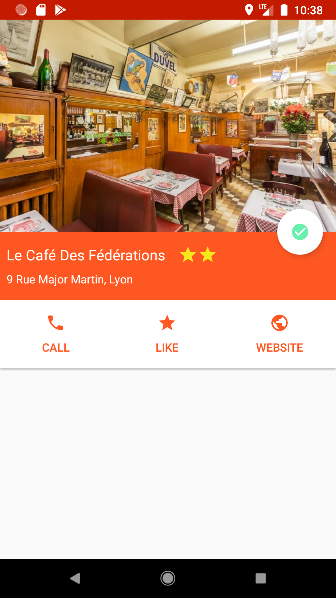
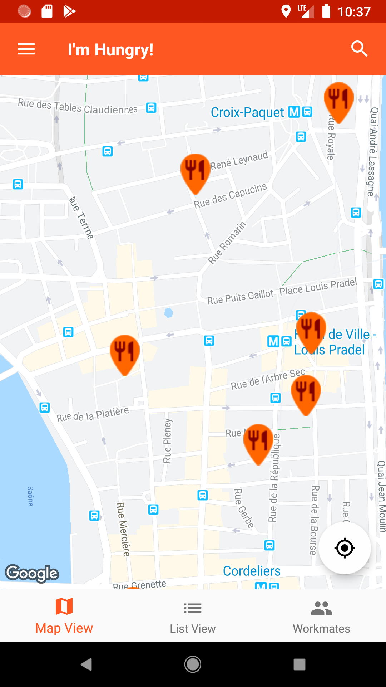
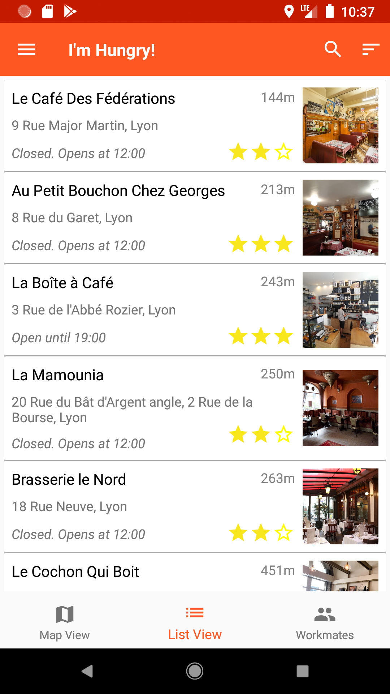
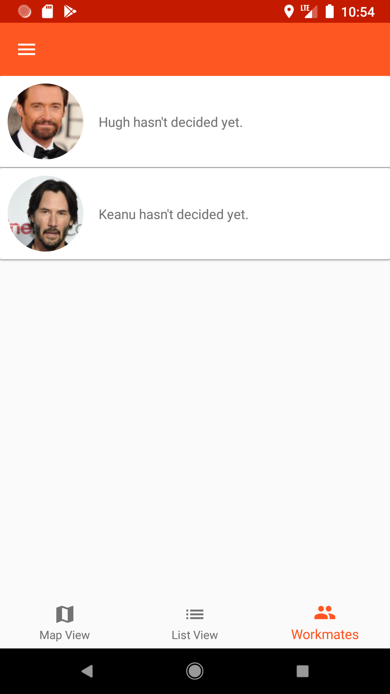

# Go4Lunch

Ce dépôt contient le projet 7 pour le parcours OpenClassrooms Développeur d'applications Android.

## Aperçu

Go4Lunch est une application pour trouver un restaurant où déjeuner avec vos collègues. 
Vous pouvez : 
 * Visualiser les restaurants autour de vous sur une carte ou sur une liste
 * Afficher les coordonnées de chaque restaurant et les appeler directement pour réserver une table
 * Voir où vos collègues souhaitent déjeuner
 * Choisir un restaurant pour le déjeuner d'aujourd'hui
 
 Vous recevrez une notification chaque jour à midi pour vous rappeler où vous allez déjeuner et qui vient avec vous.
 
 &ensp;&ensp;
 
 &ensp;&ensp;
 
## Libraries
* [Glide](https://github.com/bumptech/glide/)
* [Gson](https://github.com/google/gson/)
* [ButterKnife](https://jakewharton.github.io/butterknife/)
* [Retrofit](https://square.github.io/retrofit/)
* [RxJava](https://github.com/ReactiveX/RxJava)
* [Firebase Authentification](https://firebase.google.com/docs/auth)
* [Cloud Storage](https://firebase.google.com/docs/storage)
* [Facebook Android SDK](https://developers.facebook.com/docs/android/)
* [Maps Android SDK](https://developers.google.com/maps/documentation/android-sdk/intro)
* [Place Android SDK](https://developers.google.com/places/android-sdk/intro)

## API
* [Google Map API](https://maps.googleapis.com)

## App Architecture
* MVVM
* databinding
* Java
